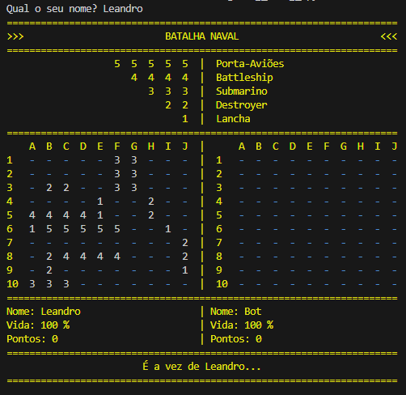

# Sea Battle

**<a href="https://github.com/Leandro-Cardoso/GAME-Sea-Battle-CMD/blob/master/LICENSE" target="_blank">
    🔑 MIT License
</a> 
<a href="" target="_blank">
    🌎 EXECUTÁVEL DO PROJETO
</a>** - Download indisponível

    <h2>Sobre</h2>

⚙️🔨 **Em desenvolvimento** 
Um jogo de batalha naval para rodar no terminal (CMD).  
Esse projeto foi desenvolvido como trabalho da Universidade de Vassouras, curso de Engenharia de Software, disciplina de Pensamento Computacional, ministrada pelo professor João Coelho. 

    

### ⚙️ Tecnologias:
* Python 3.7.9
* Pygame 2.5.2 (Apenas musicas e efeitos sonoros)

### ⚙️ Development:
1. ... ⚙️✔️🔨

    <h2>Autor</h2>
    <a href="https://github.com/Leandro-Cardoso" target="_blank">
        
        <h3>Leandro Cardoso</h3>
    </a>

